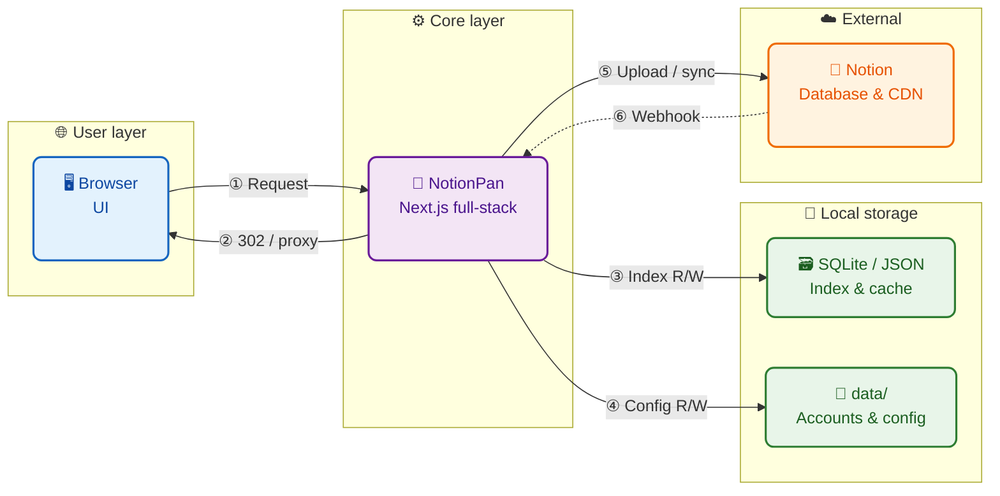

# NotionPan

Self-hosted file drive backed by **Notion**.

[English](./README.md) · [中文](./README.zh-CN.md)



**Stack** — Next.js 16 · React 19 · Tailwind CSS 4 · **Notion API** · Sharp · iron-session · Node 22

---

## 1. Features

- Core drive
    - Upload, download, move, delete (302) (max depends on Notion plan, up to ~5 GB on paid)
    - Previews for common types (audio / video tuned)
    - Gallery view
- Offline import
    - Pull files from public HTTPS URLs via Notion API
    - Does not consume your server bandwidth for the file body
- Sharing
    - Time-limited share links
    - Server-side proxy for guests
- Index
    - SQLite local index to avoid hitting Notion on every list/search
    - Backup / restore (SQLite, JSON)
- Other
    - Notion webhooks, site customization, …
- ~~WEBDAV~~
    - ~~Relay / mount (openlist, alist)~~

---

## 2. Quick Start

<details open>
<summary><b>Docker</b> — recommended</summary>

```bash
git clone https://github.com/xmsssssss/NOTIONPAN.git
cd NOTIONPAN
cp .env.example .env
# change SESSION_SECRET before going live

docker compose up -d --build
```

| | |
| --- | --- |
| Open | `http://localhost:3000` or `http://<server-ip>:3000` |
| Logs | `docker compose logs -f` |
| Stop | `docker compose down` |

</details>

<details>
<summary><b>From source</b> — Node.js 22+</summary>

```bash
git clone https://github.com/xmsssssss/NOTIONPAN.git
cd NOTIONPAN
npm install
cp .env.example .env.local
npm run dev          # → http://localhost:3000
```

Production:

```bash
npm run build
SESSION_SECRET='your-long-random-secret' COOKIE_SECURE=0 npm start
```

</details>

---

## 3. Notion Setup (guided in the UI after deploy)

Official docs: [Notion Developers — Get started](https://developers.notion.com/guides/get-started/overview)

### 1. Integration token

1. Open [Notion Integrations](https://www.notion.so/my-integrations)
2. Create a new integration
3. Copy the secret (`ntn_…`) → `NOTION_API_KEY`

### 2. Database

| Path | Steps |
| --- | --- |
| **A · Auto-create** | Admin → **Index Sync** → create database |
| **B · Manual** | Create a database with the schema below, then connect the integration (**⋯ → Connections**) (you can paste the schema to Notion AI) |

**Manual schema**

| Property | Type |
| --- | --- |
| `Name` | Title |
| `Folder` | Text |
| `Size` | Number |
| `MIME` | Text |
| `Type` | Select — `image` / `video` / `audio` / `pdf` / `file` |
| `File` | Files & media |

### 3. Database ID

```
https://www.notion.so/xxxxxxxxxxxxxxxxxxxxxxxxxxxxxxxx?v=...
                     └────────── Database ID ─────────┘
```

---

## 4. Environment Variables

| Variable | Required | Description |
| --- | --- | --- |
| `SESSION_SECRET` | **prod** | Cookie encryption secret · ≥32 characters |
| `COOKIE_SECURE` |  | `0` = allow HTTP · `1` = HTTPS-only cookies |
| `PORT` |  | Compose host port · default `3000` |
| `NOTION_API_KEY` | * | Integration token · or set in the UI |
| `NOTION_DATABASE_ID` | * | Database ID · or set / auto-create in the UI |
| `NOTION_DATA_SOURCE_ID` |  | Usually leave empty |
| `NOTION_WEBHOOK_TOKEN` |  | Written automatically after webhook verification |
| `DATA_DIR` |  | Data root · default `./data` · Docker `/app/data` |

\* Optional if configured in the web UI after login.

Full template: [`.env.example`](./.env.example). Runtime env saved from admin is persisted under the data directory (Docker volume-friendly).

---

**Downloads**

| Who | Behavior |
| --- | --- |
| Logged-in: preview / download | `302` → Notion temporary URL |
| Share guest | Proxied by this server · Notion URL never exposed |

---

## Webhooks (optional)

Incremental index updates and faster URL-import completion.

Requires a public **HTTPS** endpoint:

```
https://your-domain/api/webhooks/notion
```

**Suggested subscriptions**

```
file_upload.completed | upload_failed | expired
page.created | deleted | undeleted | properties_updated
```

On first verification the token is stored as `NOTION_WEBHOOK_TOKEN`. Without webhooks, click **Refresh index** after editing files directly in Notion.

---

## 5. Deployment Notes

| Topic | Detail |
| --- | --- |
| Image | Multi-stage · Next.js `standalone` · Node 22 |
| Data volume | `/app/data` · named volume `notionpan-data` |
| Bind mount | Optional: `./data:/app/data` |
| HTTPS reverse proxy | Set `COOKIE_SECURE=1` and restart |
| Health checks | `GET /api/auth/status` · `GET /api/health` |

```yaml
# optional bind-mount instead of named volume
volumes:
  - ./data:/app/data
```

Persisted under the data directory: admin account, site config, local index, shares, thumbnails, and runtime env.

---

## Project Layout

```
src/
  app/           # App Router pages & API
  components/    # Drive UI, admin, preview, share
  lib/           # Notion, index, auth, share, backup
data/            # Runtime data (gitignored)
Dockerfile
docker-compose.yml
.env.example
```

---

## 6. Acceptable Use

This project is **for personal / self-hosted use only**, with **your own** Notion workspace.

Follow the [Notion Terms](https://www.notion.com/terms) and [API guidelines](https://developers.notion.com/guides/get-started/overview); keep integration secrets private; keep request rates reasonable; host only content you have rights to.

### Strictly prohibited

The following is **forbidden**. Abuse may cause Notion to revoke your integration; you are solely responsible for the consequences:

- **Do not** use this service as a free CDN, mass file host, or commercial storage platform
- **Do not** scrape, spam-upload, or abuse the Notion API
- **Do not** bypass plan limits, rate limits, or security controls
- **Do not** host malware or illegal material
- **Do not** resell, open to the public, or proxy access in ways that overload Notion or this service
- **Do not** commit integration secrets to public repos or share them

You are solely responsible for deployment and operation.

---

## Limitations

- **File size**: Limited by Notion plan · free ≈ 5 MB · paid (e.g. Plus/Business) up to ≈ 5 GB per file
- **Delete**: Archives to Notion trash · not hard-delete
- **Folders**: Path string in `Folder` · not native Notion hierarchy
- **URL import**: Public HTTPS only · must be reachable by Notion (some signed URLs may fail)

---

## License

Released under the [MIT License](./LICENSE).
