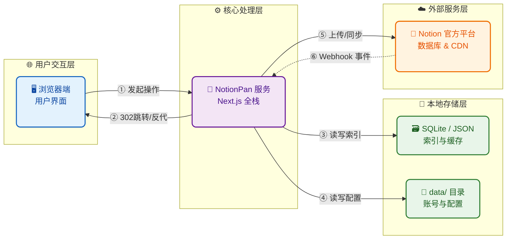

# NotionPan

基于 **Notion** 的自托管网盘。

[English](./README.md) · [中文](./README.zh-CN.md)



**技术栈** — Next.js 16 · React 19 · Tailwind CSS 4 · **Notion API** · Sharp · iron-session · Node 22

---

## 一、功能

- 基础网盘功能
    - 文件上传（代理）、下载（302）、移动、删除（最大限制5GB）
    - 各种类型文件预览（主要优化了音乐和视频）
    - 画廊模式
- 离线下载
    - 依靠notion接口拉取 HTTPS 链接文件
    - 不走服务器流量
- 分享功能
    - 可分享带有效期文件
    - 服务器代理
- 索引
    - 依靠SQLite实现数据库索引，避免每次请求notion接口
    - 备份、恢复（SQLite、JSON）
- 其他
    - Notion Webhook 通知、网站自定义配置 …
- ~~WEBDAV~~
    - ~~作为中转站、实现被挂载（openlist、alist）~~

---

## 二、快速开始

<details open>
<summary><b>Docker</b> — 推荐</summary>

</details>

</details>

```bash
git clone https://github.com/xmsssssss/NOTIONPAN.git
cd NOTIONPAN
cp .env.example .env
# 上线前请修改 SESSION_SECRET

docker compose up -d --build
```

| 访问 | `http://localhost:3000` 或 `http://服务器IP:3000` |
| --- | --- |
| 日志 | `docker compose logs -f` |
| 停止 | `docker compose down` |

</details>

<details>
<summary><b>源码运行</b> — Node.js 22+</summary>

</details>

</details>

```bash
git clone https://github.com/xmsssssss/NOTIONPAN.git
cd NOTIONPAN
npm install
cp .env.example .env.local
npm run dev          # → <http://localhost:3000>
```

生产环境：

```bash
npm run build
SESSION_SECRET='你的长随机密钥' COOKIE_SECURE=0 npm start
```

</details>

---

## 三、Notion 配置（部署后前端会有引导界面）

官方文档：[Notion Developers — 入门概览](https://developers.notion.com/guides/get-started/overview)

### 1. 集成令牌

1. 打开 [Notion 集成](https://www.notion.so/my-integrations)
2. 创建新集成
3. 复制密钥（`ntn_…`）→ `NOTION_API_KEY`

### 2. 数据库

| 方式 | 步骤 |
| --- | --- |
| **A · 自动创建** | 后台 → **索引同步** → 创建数据库 |
| **B · 手动创建** | 按下方 Schema 建库，再将集成加入连接（**⋯ → 连接**）（建议复制发给notionAI） |

**手动 Schema**

| 属性 | 类型 |
| --- | --- |
| `Name` | Title |
| `Folder` | Text |
| `Size` | Number |
| `MIME` | Text |
| `Type` | Select — `image` / `video` / `audio` / `pdf` / `file` |
| `File` | Files & media |

### 3. Database ID

```
https://www.notion.so/xxxxxxxxxxxxxxxxxxxxxxxxxxxxxxxx?v=...
                      └────────── Database ID ─────────┘
```

---

## 四、环境变量

| 变量 | 必填 | 说明 |
| --- | --- | --- |
| `SESSION_SECRET` | **生产** | 会话加密密钥 · ≥32 字符 |
| `COOKIE_SECURE` |  | `0` = 允许 HTTP · `1` = 仅 HTTPS Cookie |
| `PORT` |  | Compose 映射端口 · 默认 `3000` |
| `NOTION_API_KEY` | * | 集成令牌 · 也可网页配置 |
| `NOTION_DATABASE_ID` | * | 数据库 ID · 也可网页配置 / 自动创建 |
| `NOTION_DATA_SOURCE_ID` |  | 一般留空 |
| `NOTION_WEBHOOK_TOKEN` |  | Webhook 校验后自动写入 |
| `DATA_DIR` |  | 数据目录 · 默认 `./data` · Docker `/app/data` |

\* 登录后在网页配置则可省略。

完整模板：[`.env.example`](https://app.notion.com/p/xmstudent/.env.example)  后台保存的运行时环境变量会写入数据目录（便于 Docker 卷持久化）。

---

**下载方式**

| 对象 | 行为 |
| --- | --- |
| 登录用户：预览、下载 | `302` → Notion 临时链接 |
| 分享访客 | 服务器反代 · 不暴露 Notion 地址 |

---

## Webhook（可选）

用于索引增量更新，并让链接导入更快完成。

需要公网 **HTTPS** 地址：

```
https://你的域名/api/webhooks/notion
```

**建议订阅**

```
file_upload.completed | upload_failed | expired
page.created | deleted | undeleted | properties_updated
```

首次校验会将 token 写入 `NOTION_WEBHOOK_TOKEN`。未配置时，在 Notion 内手改文件后请点 **刷新索引**。

---

## 五、配置相关

| 项 | 说明 |
| --- | --- |
| 镜像 | 多阶段构建 · Next.js `standalone` · Node 22 |
| 数据卷 | `/app/data` · 命名卷 `notionpan-data` |
| 绑定目录 | 可选：`./data:/app/data` |
| HTTPS 反代 | 设置 `COOKIE_SECURE=1` 后重启 |
| 健康检查 | `GET /api/auth/status` · `GET /api/health` |

```yaml
# 可选：用本机目录替代命名卷
volumes:
  - ./data:/app/data
```

数据目录会持久化：管理员账号、站点配置、本地索引、分享记录、缩略图、运行时环境变量。

---

## 目录结构

```
src/
  app/           # App Router 页面与 API
  components/    # 网盘界面、后台、预览、分享
  lib/           # Notion、索引、鉴权、分享、备份
data/            # 运行时数据（已 gitignore）
Dockerfile
docker-compose.yml
.env.example
```

---

## 六、使用规范

本项目**仅面向个人 / 自托管**，请使用**你自己的** Notion 工作区。

请遵守 [Notion 条款](https://www.notion.com/terms) 与 [API 说明](https://developers.notion.com/guides/get-started/overview)；妥善保管集成密钥；控制请求频率；仅存储你有权托管的内容。

### 严禁滥用

以下行为**一律禁止**，一经发现可能导致 Notion 停用你的集成，相关后果由使用者自行承担：

- **严禁**将本服务当作免费 CDN、大规模网盘或商用存储
- **严禁**批量爬取、刷上传、滥用 Notion API
- **严禁**绕过套餐限额、速率限制或任何安全机制
- **严禁**托管恶意软件或违法内容
- **严禁**转售、对外开放或代理访问，导致 Notion 或本服务过载
- **严禁**将集成密钥提交到公开仓库或外传

部署与运营责任由使用者自行承担。

---

## 限制

- **文件大小**：受 Notion 套餐限制单文件上传 · 免费约 5 MB · PRO约 5 GB
- **删除**：归档到回收站 · 非物理删除
- **文件夹**：`Folder` 字段路径 · 非 Notion 原生目录
- **链接导入**：仅公网 HTTPS · 且需 Notion 可访问（部分带签名的可能拉不下来）

---

## License

本项目基于 [MIT 开源协议](https://github.com/xmsssssss/NOTIONPAN/blob/master/LICENCE) 开源。
